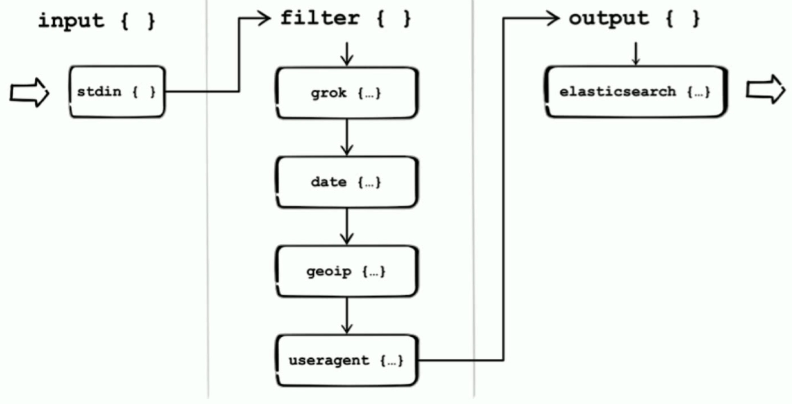
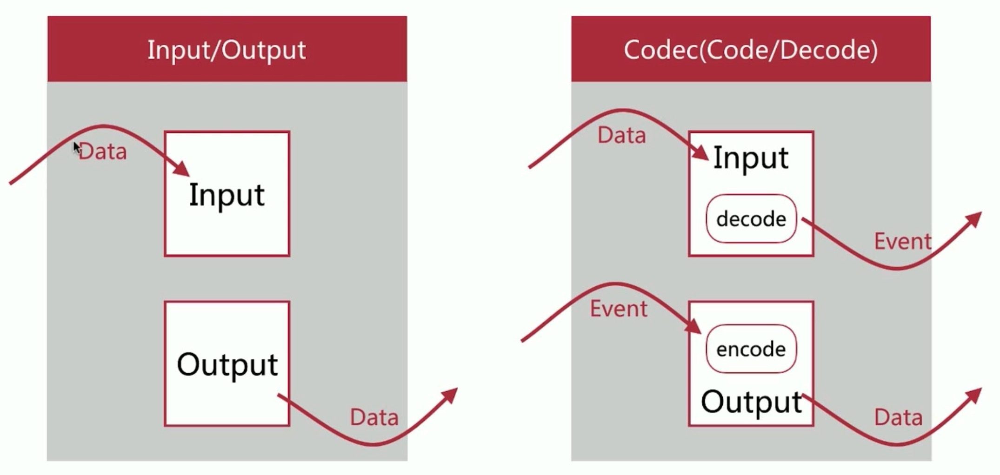
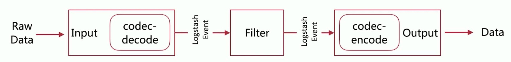
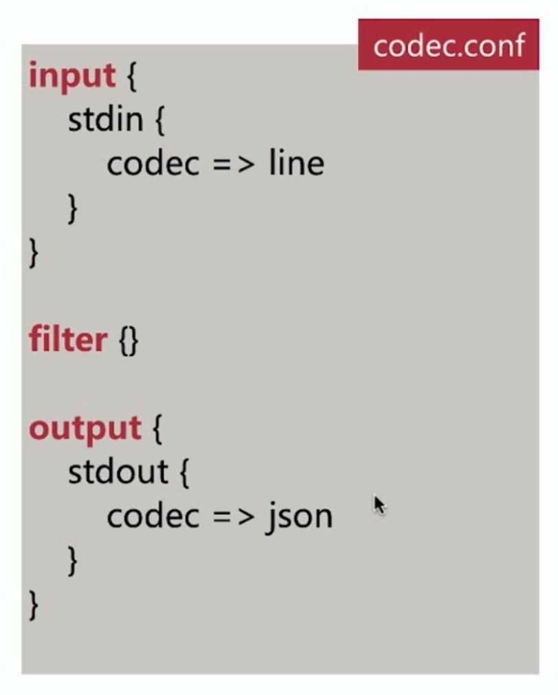
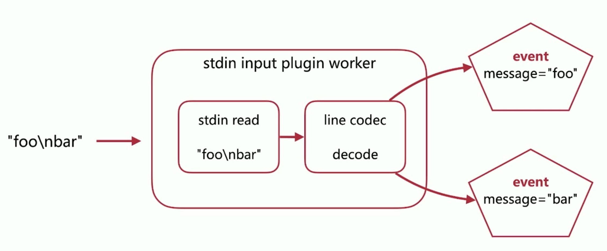
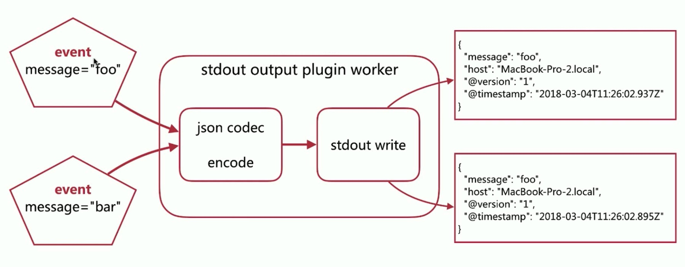
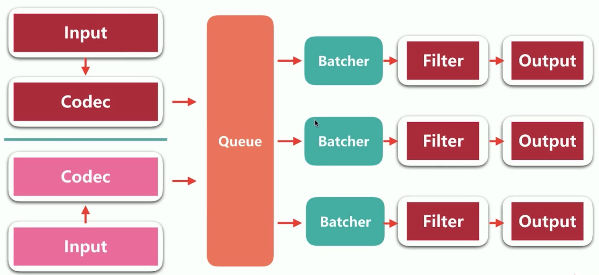
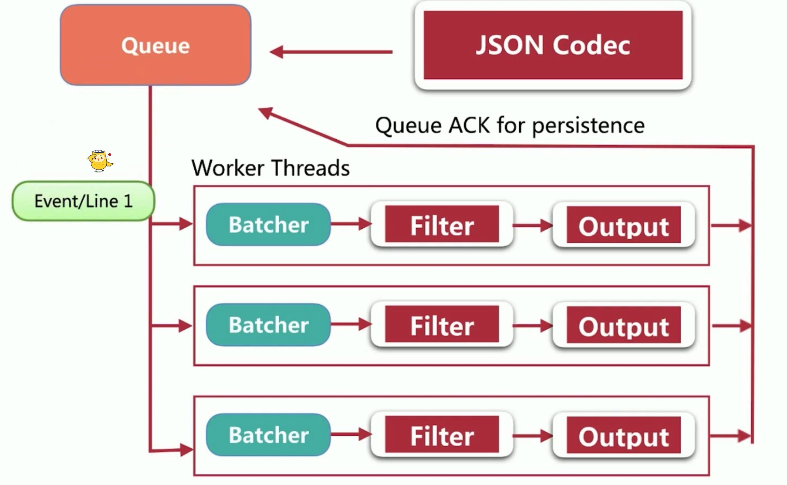

# Logstash

## 1. Logstash 入门与运行机制

下图展示了一张相对完备的 Logstash 数据处理流：

+ input 使用了 stdin 插件，即数据从标准输入流进来
+ filter 插件可以有多个
  + 首先是 grok 插件，它使用了正则匹配的方式，抽取出 record 中的一些内容，作为独立的字段
  + date 用来处理日期类型
  + geoip 添加地理位置信息
  + useragent 将请求的 agent 的信息提取出来
+ filter 执行完后，就到了 output 阶段
  + 此处使用的是 elasticsearch 插件，将数据输出到 elasticsearch 中

### 1.1 入门及架构简介

#### 1.1.1 Pipeline

+ input-fileter-output 的3阶段处理流程
+ 队列管理
+ 插件生命周期管理

#### 1.1.2 Logstash Event

+ 内部流转的数据表现形式
  + 原始数据从 input 进来之后，在 Logstash 内部流转时，并非原始的数据，而是 Logstash Event
  + Logstash Event 实际上是 Java Object，它对外暴露了去修改内部字段值以及获取内部字段值的一些 API
+ 原始数据在 input 被转换为 Event，在 output，event 被转换为目标格式数据
+ 在配置文件中（即 Logstash 脚本中）可以对 Event 中的属性进行增删改查

来看左下这幅图，原始数据从 Input 进来，从 output 出去时也是符合目标数据源的类型的。

什么东西把原始数据转换成 Logstash Event 了呢？是 Codec 这种机制。

将 Codec 加入到架构中，如下：

原始数据在 Input 进来之后，经过 codec 的 decode 后，转换成了 Logstash Event，Logstash Event 流入 Filter，经过 Filter 中每一个 Filter Plugin 的处理后流出进入 Output，在 Output 中会把每一个 Logstash Event 按照目标数据源需要的 format 进行 encode，最后输出出去。

来看一个例子，如下：

input 使用了 stdin，即标准输入，设置的 codec 是 line，作用是按每一行切割数据，将每一行都转换成一个 Logstash Event，filter 这里是空的，output 使用了 stdout，即标准输出，设置的 codec 是 json，会将每一个 Logstash Event 按 json 格式的字符串输出。执行 `bin/logstash -f codec.conf`，即可运行。

针对以上例子，可以看下其 Codec 的运作，首先来看 Codec - Input Decoding，

假设 `"foo\nbar"` 流进了「标准输入」，那么首先会在 stdin input plugin 中进行处理，标准读入插件首先会将内容，也就是 `"foo\nbar"` 读取进来，然后交给 line codec 进行 decode，line codec 按照换行符进行切分，因此原始数据 `"foo\nbar"` 被分成了两个 event，每个 event 都会有一个 message 字段。

不难发现，原始数据与 Logstash event 不是一对一的关系，很可能是一对多的关系。甚至在 filter 中，原始数据对应的 Logstash Event 直接被 drop 掉也是有可能的。

再来看，Codec - Output Encoding，

当两个 Logstash Event 到达标准输入插件时，首先会经过 json codec 的 encode 方法，转换成 json object，然后输出到标准输出。 

### 1.2 Logstash Event 生命周期

观察以下图片，

上图所示的是 Logstash 6.x 中的架构。

首先 Input 是可以有多个的，每个 Input 可以有自己的 Codec，图中的箭头代表数据的流向。图中有 3 条 pipeline，每一条 pipeline 均包含 Batcher，Filter 以及 Output。其中，Batcher 的作用是批量的从 Queue 中取数据。

数据从 input 进来，经过 input 插件的处理（包含 decode），转换成 Logstash Event 进入 Queue 中，然后流入到某一条 pipeline 的 Batcher 中，随着时间的增长，Batcher 会收集到越来越多的 event，当达到处理数据的临界点后（可以是 Batcher 中 event 的数目达到设定的阈值，或者是时间到了），Batcher 会把 event 发送到 Filter 中，在 Filter 中会对每一条 event 进行处理，然后到达 Output 输出到指定输出。输出之后，Output Plugin 最后还会发送一个 ACK 给 Queue，告知 Queue 处理了哪一些 event。Queue 知道哪些 event 被处理后，就可以做一些标记性的操作。后面讲持久化队列的时候，会用到这个 ACK。具体，如下图所示：

### 1.3 Queue 简介

### 1.4 线程简介

### 1.5 配置简介

### 1.6 多实例运行

### 1.7 pipeline 配置简介