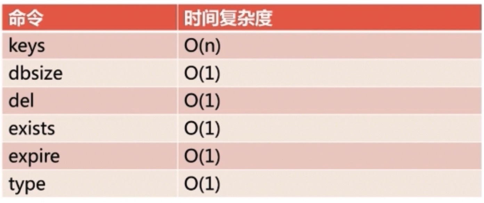
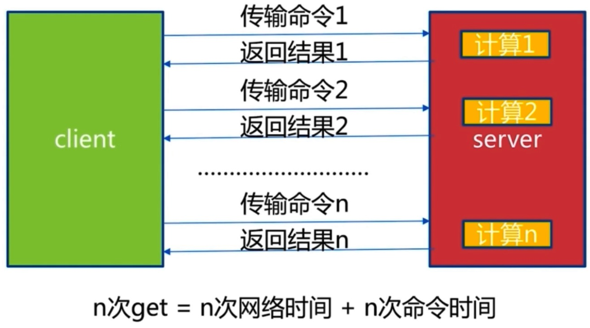
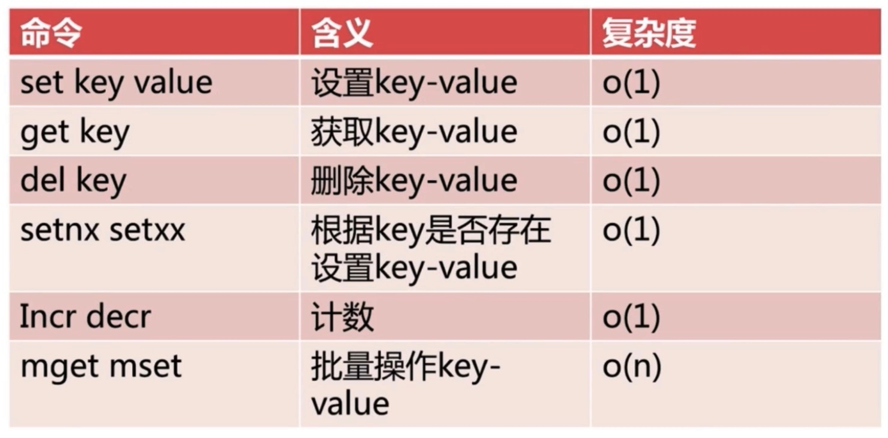

# Redis

## 第1章 Redis 初识

+ 速度快，10Wops（每秒可以进行 10 万次读写）
+ 持久化  
  + Reids所有数据保持在内存中，对数据的更新将异步地保存到磁盘上
  + RDB、AOF两种方式
+ 多种数据结构
+ 支持多种客户端语言
+ 功能丰富
  + 发布订阅
  + 事务
  + lua 脚本
  + pipeline
+ 简单
  + 单机版本，23000 lines of code
  + 不依赖外部库（like libevent）
  + 单线程模型
+ 主从复制
  + 为高可用和分布式提供基础
+ 高可用、分布式
  + Redis-Sentinel（v2.8）支持高可用
  + Redis-CLuster（v3.0）支持分布式
+ 典型应用场景
  + 缓存系统
  + 计数器
  + 消息队列系统
  + 排行榜
  + 社交网络
  + 实时系统

### 1.1 Redis 安装

+ 所有 release 版本链接：http://download.redis.io/releases/
+ Redis 官网安装页面：https://redis.io/download
+ 具体安装步骤如下：
  + 下载：`wget http://download.redis.io/releases/redis-3.2.12.tar.gz`
  + 解压：`tar -xzf redis-3.2.12.tar.gz`
  + 建一个软连接（可选）：`ln -s redis-3.2.12 redis`
  + 进入 redis 目录：`cd redis`
  + 编译（会在 redis/src 目录下生成可执行文件）：`make`
  + 安装（会将 redis/src 目录下的可执行文件拷贝到 /user/local/bin 中）：`sudo make install`
+ 注意事项：
  + 通过 `echo $PATH` 命令，可以发现 `/usr/local/bin` 在环境变量中，因此执行完 `make install` 命令后，可以在任意目录下直接运行类似 `redis-server` 等可执行文件
  + 执行 `make isntall` 命令，需要 root 权限，这是因为 `/usr/local/bin` 目录只有 root 用户才拥有写权限，而拷贝文件到目录中，需要拥有对目录的写权限
  + 具体细节可以参看 `redis/src/Makefile`

### 1.2 Redis 可执行文件说明

安装完毕后，可以在 `reids/src` 或 `/usr/local/bin` 目录下看到 6 个可执行文件，如下：

+ redis-server：Redis 服务器
+ redis-cli：Redis 命令行客户端
+ redis-benchmark：Redis 性能测试工具
+ reids-check-aof：AOF 文件修复工具（断电可能会导致文件损坏）
+ redis-check-dump：RDB 文件修复工具
+ redis-sentinel：Redis 2.8 以后，提供了高可用版本，即 Sentinel 服务器

### 1.3 Redis 三种启动方法  

+ 最简启动
+ 动态参数启动
+ 配置文件启动
+ 比较

#### 1.3.1 最简启动 Reids

+ 编译安装后，直接执行 `redis-server`，使用 Redis 的默认配置进行启动
+ 验证启动的方法：
  + 查看进程：`ps -ef | grep redis`
  + 查看端口是否为 listen 状态：`netstat -antpl | grep redis`
  + 使用 `redis-cli -h ip -p port ping`

#### 1.3.2 动态参数启动 Redis

+ 例如：`redis-server --port 6380`
+ Redis 使用 6379 作为默认端口，如果想使用 6380 端口启动 Redis，就可以使用如上方式

#### 1.3.3 配置启动 Redis

+ 将需要的配置写在配置文件中
+ `redis-server configPath` 

#### 1.3.4 三种启动方式比较

+ 生产环境选择「配置启动」
  + Redis 是单线程模型，为了利用服务器的多核优势（资源的合理利用），通常会在一台机器上部署多个 Redis，此时使用默认启动或者动态参数启动较为麻烦
+ 单机多实例配置文件可以用端口区分开 

### 1.4 Redis 客户端连接

```bash
acjx@acjx:~$ redis-cli -h localhost -p 6379
localhost:6379> ping
PONG
localhost:6379> set hello world
OK
localhost:6379> get hello
"world"
```

### 1.5 Redis 客户端返回值

+ 状态回复

```bash
localhost:6379> ping
PONG
```

+ 错误回复
  + 以下例子使用获取哈希的命令执行在字符串的 key 上，返回错误

```bash
localhost:6379> hget hello field
(error) WRONGTYPE Operation against a key holding the wrong kind of value
```

+ 整数回复

```bash
localhost:6379> incr cnt
(integer) 1
```

+ 字符串回复

```bash
localhost:6379> get hello
"world"
```

+ 多行字符串回复

```bash
localhost:6379> mget hello foo
1) "world"
2) "bar"
```

### 1.6 Redis 常用配置

+ daemonize：是否以守护进程的方式启动
  + 默认配置是 no，即不以守护进程的方式启动
  + 建议使用 yes
  + 当使用 yes 时，启动日志会打印到配置的日志文件中
+ port：Redis 对外端口号，在单机多实例的情况下必须进行配置，默认端口是 6379
+ logfile：Redis 系统日志文件名，Reids 的工作情况以及发生的异常都会被记录在日志中
+ dir：Redis 工作目录，日志文件、持久化文件均会被存储在工作目录，注意上面的 logfile 只是文件名
+ 可以通过 `localhost:6379> config get *` 的方式查看有多少配置文件，均以 key-value 形式存储

## 第2章 API 的理解和使用

### 2.1 通用命令

通用命令针对任意数据结构，如下：

+ keys
  + keys 命令一般不在生产环境使用，因为这是一个 O(n) 的命令，而 Redis 是单线程的，如果数据量非常大（例如有100万条数据），这个命令会阻塞其他命令
  + keys * 怎么用？
    + 使用 `scan` 命令代替
    + 可以在「热备从节点」上执行一些比较重的命令，因为通常来说，从节点不会给生产环境去使用
+ dbsize：计算 key 的总数
  + O(1)
  + 可以在生产环境使用，因为 Redis 内部维护了一个计数器，会实时去维护 key 的总数，而不需要每次遍历才能得到
+ exists key：检查 key 是否存在
  + O(1)，可以在线上使用
  + 如果存在，返回 1 ，否则返回 0
+ del key [key ...]：删除指定的 key-value
  + 成功删除返回 1，否则返回 0
+ expire key seconds：给 key 设置秒级别的过期时间
  + 为 key 设置过期时间，经过所设定的时间后，key 会被自动删除
+ ttl key：查看 key 剩余的过期时间
  + 返回值如果大于等于 0，表示还剩多少过期时间
  + 返回值如果为 -1，说明 key 没有设置过期时间，永久存在
  + 返回值如果为 -2，说明 key 不存在，可能到了过期时间已被删除，或者原来就不存在
+ persist key：去掉 key 的过期时间
+ type key：返回 key 的类型

#### 2.1.1 时间复杂度



### 2.2 字符串键值结构

+ 使用场景
  + 缓存
  + 计数器
  + 分布式锁
+ API
  + get/set/del 
    + get key：获取 key 对应的 value，时间复杂度 O(1) 
    + set key value：设置 key-value，时间复杂度 O(1)
    + del key：删除 key-value，前面讲过，这个一个通用命令，时间复杂度 O(1)
  + incr/decr/incrby/decrby
    + incr key：key 自增 1，如果 key 不存在，自增后 get(key)=1，时间复杂度 O(1)
    + decr key：key 自减 1，如果 key 不存在，自减后 get(key)=-1，时间复杂度 O(1)
    + incrby key k：key 自增 k，如果 key 不存在，自增后 get(key)=k，时间复杂度 O(1)
    + decrby key k：key 自减 k，如果 key 不存在，自减后 get(key)=-k，时间复杂度 O(1)
  + set/setnx/set xx
    + set key value：不管 key 是否存在，都设置，时间复杂度 O(1)
    + setnx key value：key 不存在，才设置，可以理解为添加，时间复杂度 O(1)
    + set key value xx：key 存在，才设置，可以理解为更新，时间复杂度 O(1)
  + mget/mset
    + mget key1 key2 key3...：批量获取 key，原子操作，时间复杂度 O(n)
    + mset key1 value1 key2 value2...：批量设置 key-value，时间复杂度 O(n)
  + getset/append/strlen
    + getset key newvalue：set key newvalue 并返回旧的 value，时间复杂度 O(1)
    + append key value：将 value 追加到旧的 value，时间复杂度 O(1)
    + strlen key：返回字符串的长度（注意中文），时间复杂度 O(1) 
  + incrbyfloat/getrange/setrange
    + incrbyfloat key 3.5：增加 key 对应的值 3.5，注意，并没有提供浮点数自减的命令，当然可以传负值，达到自减的效果，时间复杂度 O(1)
    + getrange key start end：获取字符串指定下标所有的值，时间复杂度 O(1)
    + setrange key index value：设置指定下标所有对应的值，时间复杂度 O(1)

#### 2.2.1 例子

```bash
localhost:6379> get counter
(nil)
localhost:6379> incr counter
(integer) 1
localhost:6379> incrby counter 99
(integer) 100
localhost:6379> decr counter
(integer) 99
localhost:6379> get counter
"99"
```

```bash
localhost:6379> exists php
(integer) 0
localhost:6379> set php good          # 无论存在与否，都会设置
OK
localhost:6379> setnx php bad         # 添加失败，只有当不存在时才会添加
(integer) 0
localhost:6379> set php best xx       # 更新成功，存在才会更新
OK
localhost:6379> get php
"best"
localhost:6379> exists java
(integer) 0
localhost:6379> setnx java best       # 添加成功，不存在，顺利添加
(integer) 1
localhost:6379> set java easy xx      # 更新成功，存在才会更新
OK
localhost:6379> get java
"easy"
localhost:6379> exists lua
(integer) 0
localhost:6379> set lua hehe xx       # 更新失败，存在才会更新
(nil)
```

```bash
localhost:6379> mset hello world java best php good
OK
localhost:6379> mget hello java php
1) "world"
2) "best"
3) "good"
```

```bash
localhost:6379> set hello world
OK
localhost:6379> getset hello php           # 设置新值，返回旧值
"world"
localhost:6379> append hello ",java"       # 追加
(integer) 8
localhost:6379> get hello
"php,java"
localhost:6379> strlen hello               # 返回字符串的长度
(integer) 8
localhost:6379> set hello "足球"            # 中文使用 utf-8 存储，每个 word 占用 3 个字节
OK
localhost:6379> strlen hello
(integer) 6
```

```bash
localhost:6379> incr counter
(integer) 1
localhost:6379> incrbyfloat counter 1.1     # 自增一个浮点数
"2.1"
localhost:6379> get counter
"2.1"
localhost:6379> set hello cppbest           
OK
localhost:6379> getrange hello 0 2          # 获取字符串指定下标范围的值 
"cpp"
localhost:6379> get hello
"cppbest"
localhost:6379> setrange hello 3 g          # 将字符串下标为 3 的字符设置为‘g’（下标从0开始计算）
(integer) 7
localhost:6379> get hello
"cppgest"
localhost:6379> setrange hello 4 ood!       # 从字符串下标为 4 的位置开始，设置为 'ood!'
(integer) 8
localhost:6379> get hello
"cppgood!"
```


#### 2.2.2 n 次 `get` 与 `mget` 的比较

+ n 次 `get`



+ 1 次 `mget`


#### 2.2.3 字符串常用命令小结



## 第3章 Redis 客户端的使用

## 第4章 瑞士军刀 Redis 其他功能

## 第5章 Redis 持久化的取舍和选择

## 第6章 常见的持久化开发运维问题

## 第7章 Redis 复制的原理与优化

## 第8章 Redis Sentinel

## 第9章 初识 Redis Cluster

## 第10章 深入 Redis Cluster

## 第11章 缓存设计与优化

## 第12章 Redis 云平台 CacheCloud